# Цель задания
Освоить базовые принципы проектирования автоматизированного конвейера переобучения модели с использованием оркестрации и инфраструктуры как кода.

# Установка и запуск
Из зависимостей необходим только `docker` последних версий, в котором по умолчанию включен плагин `docker compose`.

Запуск осуществляется путём исполнения команды
```bash
docker compose up
```

# Особенности запуска Airflow
Стоит отметить что решение запускается полностью, как бы имитируется запуск `airflow` если бы мы его зпускали на продакшене, т.е. в docker-контейнерах запускаются следующие сервисы:
1. PostgreSQL v17 - для хранения таблиц Airflow
2. Airflow web-server
3. Airflow scheduler

# Пайплайн
В файле `dags/retrain_model.py` описан DAG который представляет собой основной пайплайн проекта. Пайплайн состоит из 4-х этапов:
1. Обучение модели `train_model`. Здесь происходит обучение модели `RandomForestClassifier` для классификации цветов ириса.
2. Инференс тестовых данных `evaluate_model`. Здесь считаем метрики классификации на отложенной выборке, на которой не происходило обучение.
3. Оператор для деплоя модели, в нашем случае просто заглушка. В производственной среде здесь может быть код публикации модели например в каком-нибудь s3-like хранилище или в artifact-registry.
4. Отправка сообщения в telegram об успешной деплое модели с указанием последней версии. Здесь стоит отметить что токен для доступа к чату в telegram, так же идентификатор чата и версия модели берутся из переменных окружения. Данные переменные указаны в `docker-compose.yml`. В случае необходимости их надо заменить на свои значения.

# Результаты и снимки экрана
1. Запуск `docker compose`: видно что команда выполняется в консоли без каких-либо проблем:
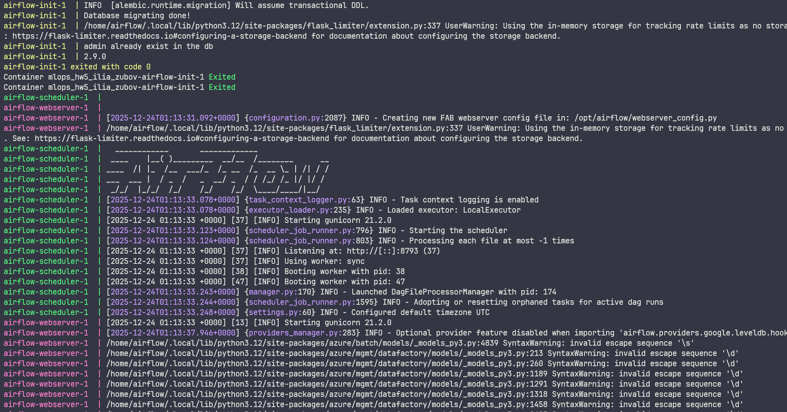
2. Экран login'а. В переменных окружения `docker-compose.yml` мы создаём пользователя `admin` с паролем `password`:
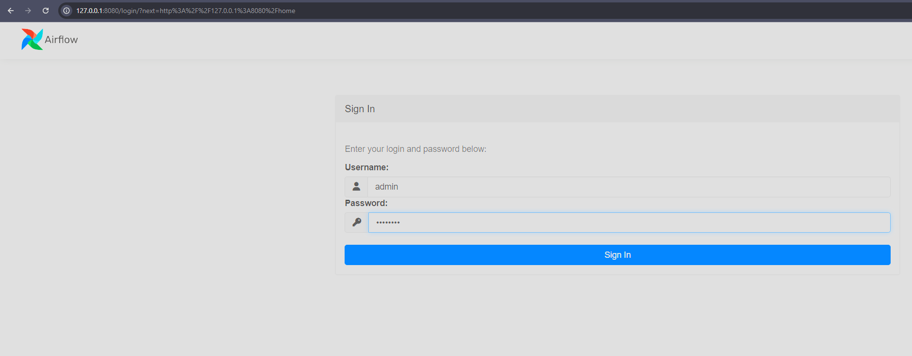
3. Видно что UI полностью функционален и описанный DAG подгружается в систему:
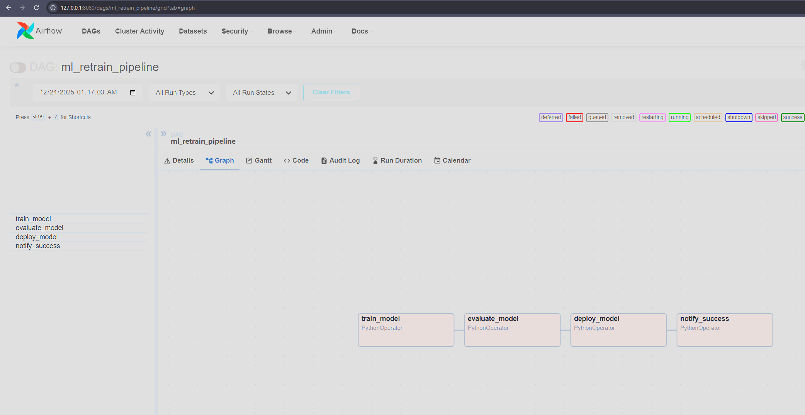
4. Осуществим ручной запуск пайплайна и проверим что он отрабатывает корректно:
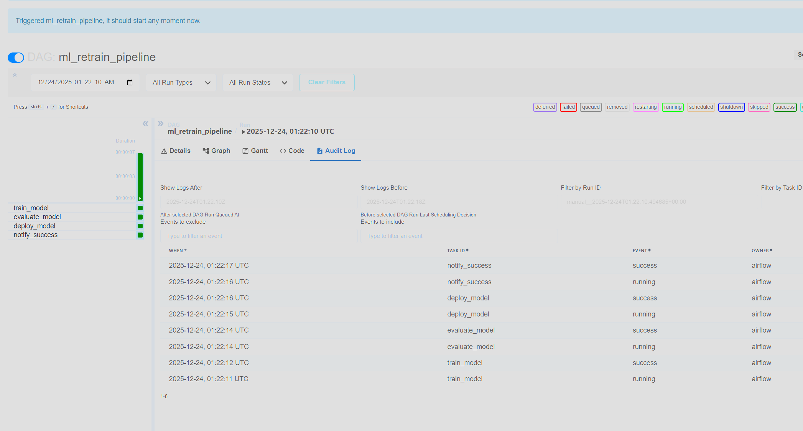
5. Проверим записываются ли логи в задачах пайплайна:
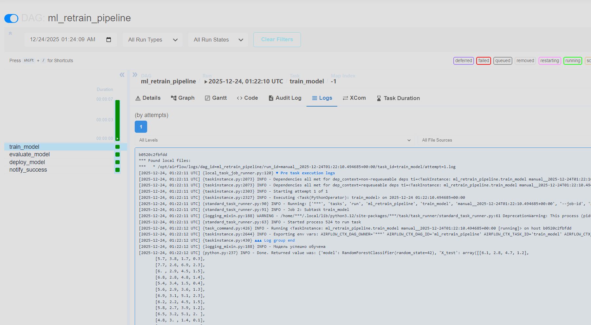
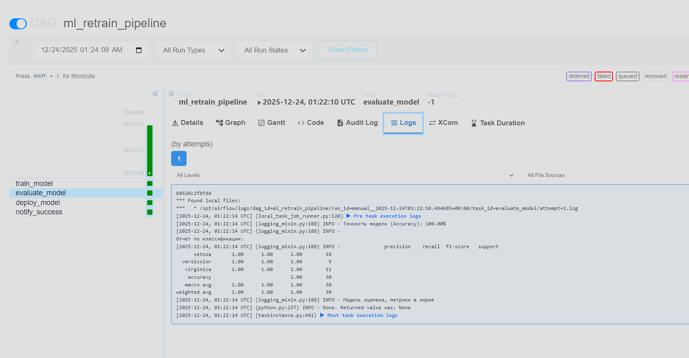
Здесь стоит отметить что между этапом `train_model` и `evaluate_model` происходит передача данных через механизм X-Com. DAG написан таким образом что бы `train_model` функция возвращала значение а в `evaluate_model` мы делаем pull X-Com объекта. Важное уточнение что передача данных из одной таски в другую происходит путём сериализации/десереализации `pickle` объекта. Для передачи `pickle` объектов мы используем настройку Airflow `enable_xcom_pickling=true` которая задаётся в `docker-compose.yml` в виде переменной окружения Airflow.
6. Убедимся что уведомления об успешном деплое новой модели приходят в заранее созданный telegram-чат:
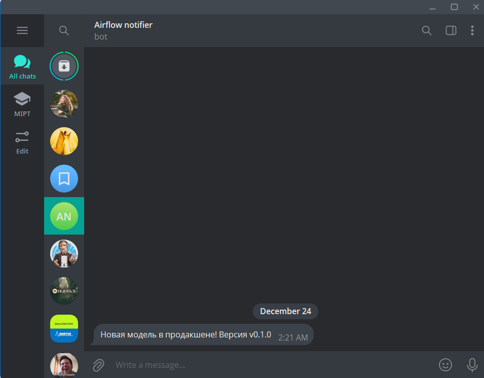
Можно заметить что версия модели 0.1.0
7. Так же убедимся что при недостаточной метрике `accuracy` мы не будем деплоить модель (т.к. модель обучена плохо) и последние два этапа просто не выолняться:
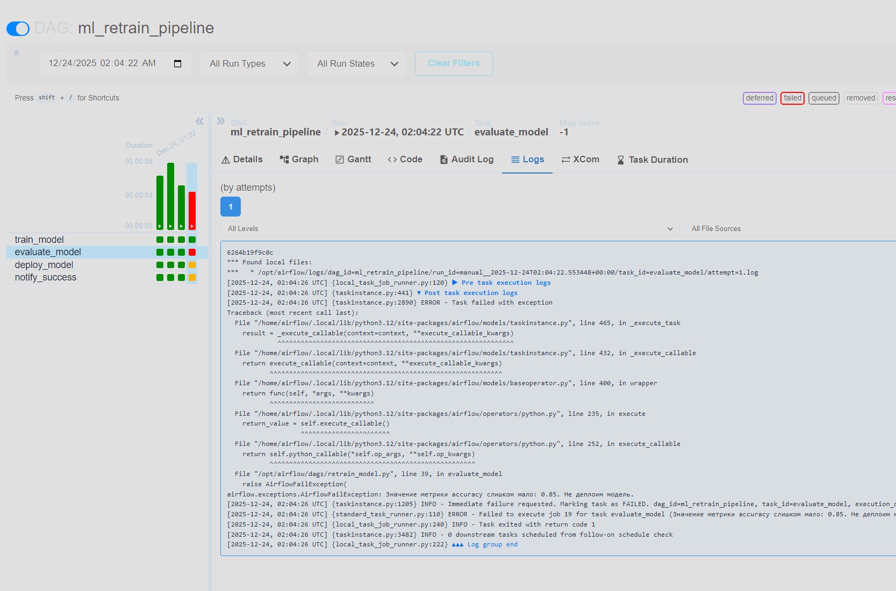
8. Обновим модель, её версию и запустим пайплайн снова, что бы увидеть что он отрабатывает корректно и мы получаем уведомление о деплое новой модели:
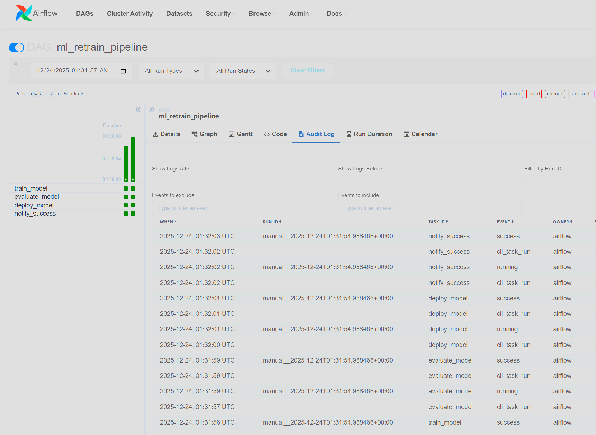
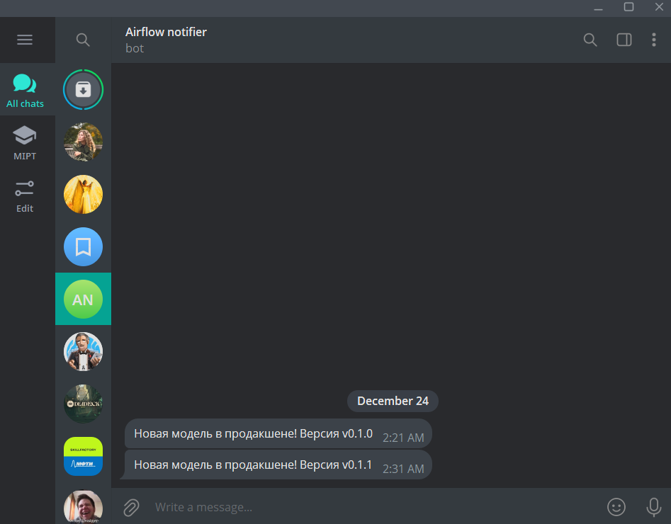
После обновления модели, уведомление пришло об изменённой модели 0.1.1
9. Так же стоит отметить что т.к. наша инсталяция airflow подразумевает mount томов внутрь контейнеров, мы можем локально посмотреть все логи, всех dag-run'ов и задач которые мы запускали. Логи должны присутствовать в локальной директории `./logs`:
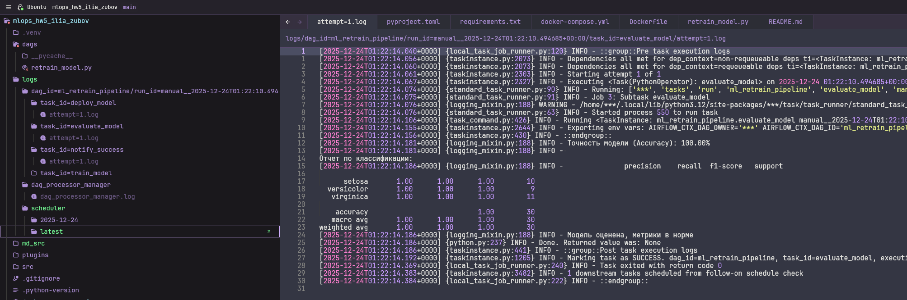

Эксперимент можно считать завершенным.
